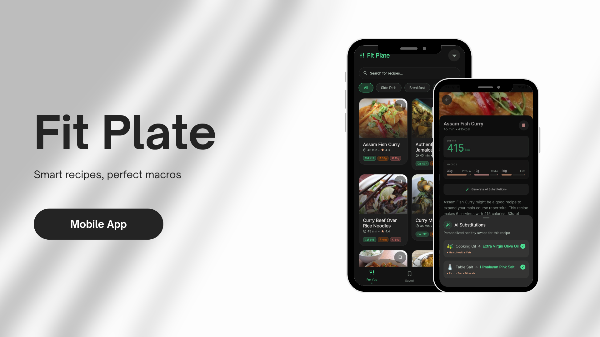
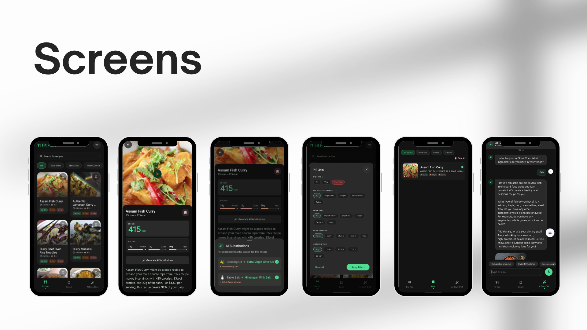

# Fit Plate 🥗



Fit Plate is a modern Android application designed to help users discover healthy recipes, manage their nutrition, and interact with an AI-powered Sous Chef for personalized cooking guidance.

## 📱 Product Overview



## 🚀 Features

- **Recipe Discovery**: Browse and search through thousands of recipes via the Spoonacular API.
- **AI Sous Chef**: Get real-time cooking assistance and personalized recipe advice using the Groq API.
- **Smart Filtering**: Filter recipes by dietary requirements, meal types, and specific tags.
- **Bookmarking**: Save your favorite recipes for easy access later (stored locally via Room).
- **Adaptive UI**: Fully responsive design supporting phones, tablets, and foldable devices using Material 3 Adaptive.

## 🛠 Tech Stack

- **UI**: [Jetpack Compose](https://developer.android.com/jetpack/compose) (100% Kotlin)
- **Design System**: [Material 3](https://developer.android.com/jetpack/compose/designsystems/material3) with Adaptive Layouts
- **Architecture**: MVVM (Model-View-ViewModel) with StateFlow
- **Dependency Injection**: [Hilt](https://developer.android.com/training/dependency-injection/hilt-android)
- **Networking**: [Retrofit](https://square.github.io/retrofit/) & [Moshi](https://github.com/square/moshi)
- **Database**: [Room](https://developer.android.com/training/data-storage/room)
- **Pagination**: [Paging 3](https://developer.android.com/topic/libraries/architecture/paging/v3-paged-data)
- **Image Loading**: [Coil](https://coil-kt.github.io/coil/)
- **Async**: Kotlin Coroutines & Flow
- **AI Integration**: Groq API

## ⚙️ Setup & Installation

To run this project locally, follow these steps:

### 1. Clone the repository
```bash
git clone https://github.com/yourusername/fit-plate.git
```

### 2. Add API Keys
The project uses several APIs that require keys. For security, these are not committed to the repository.

1. Open the project in Android Studio.
2. Locate or create a `local.properties` file in the **root directory**.
3. Add the following lines with your own API keys:

```properties
# Spoonacular API Key (Get it at: https://spoonacular.com/food-api)
SPOONACULAR_API_KEY=your_spoonacular_key_here

# Groq API Key (Get it at: https://console.groq.com/)
GROQ_API_KEY=your_groq_key_here
```

### 3. Build and Run
- Sync the project with Gradle files.
- Run the `app` module on an emulator or a physical device (Android 7.0+ / API 24+).

---

## 🔒 Security Note
This project uses the `secrets-gradle-plugin` to manage API keys. These keys are injected into `BuildConfig` at compile time and are never checked into version control. If you contribute to this project, ensure your `local.properties` is kept private.
